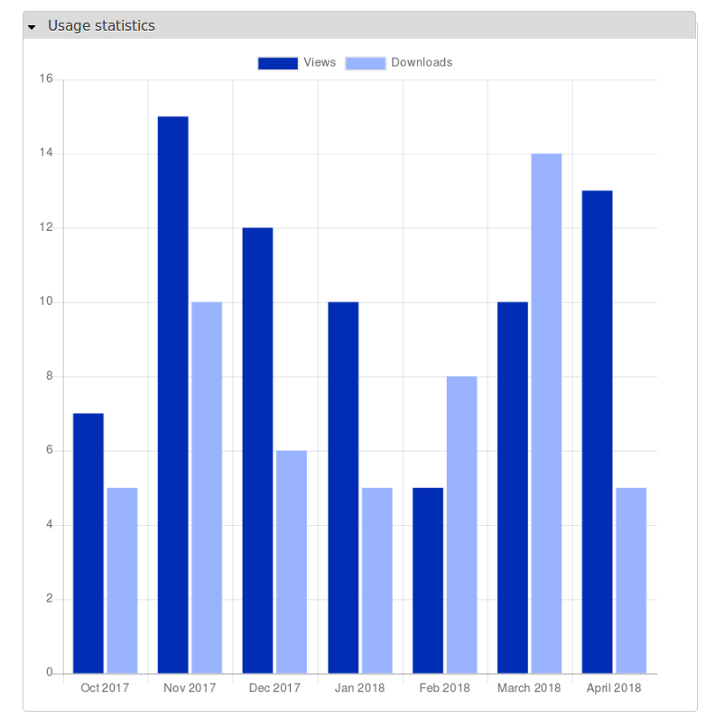

# Islandora Usage Stats Charts

## Overview

Displays object (and collection) usage stats collected by [Islandora Usage Stats](https://github.com/Islandora/islandora_usage_stats) as charts, which are rendered within standard Drupal blocks. An example chart looks like:

By default, only the last 6 months of data is shown in the chart, although the number of months can be configured.

## Dependencies

* [Islandora](https://github.com/Islandora/islandora)
* [Islandora Usage Stats](https://github.com/Islandora/islandora_usage_stats)
* MySQL. The SQL used to query the statistics uses MySQL-specific functions.

[Chart.js](http://www.chartjs.org/) is not a local requirement, since it is called from a CDN.

## Installation

Install as usual, see [this](https://drupal.org/documentation/install/modules-themes/modules-7) for further information.

## Configuration

1. Set the number of months' data, colors for your charts' "views" and "downloads" bars, etc. at `admin/islandora/tools/islandora_usage_stats_charts`.
1. Enable and configure the "Islandora Usage Stats Charts: object-level report" and "Islandora Usage Stats Charts: collection-level report" blocks.
1. In the object-level block, you have the option of having the block collapsed or open by default. This setting can be found within the block's "configure" options.

## Altering usage data

This module defines a Drupal alter hook that allows third-party modules to alter usage data for objects, for example to combine usage data from an external source with the data collected in Islandora Usage Stats database, or to filter out unwanted data. See `islandora_usage_stats_charts.api.php` for more information.

## Maintainer

* [Mark Jordan](https://github.com/mjordan)

## Development and feedback

Bug reports, use cases, feature requests, and pull requests are welcome. If you want to open a pull request, please open an issue first, and use the pull request template.

## License

* [GPLv3](http://www.gnu.org/licenses/gpl-3.0.txt)
